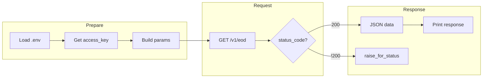
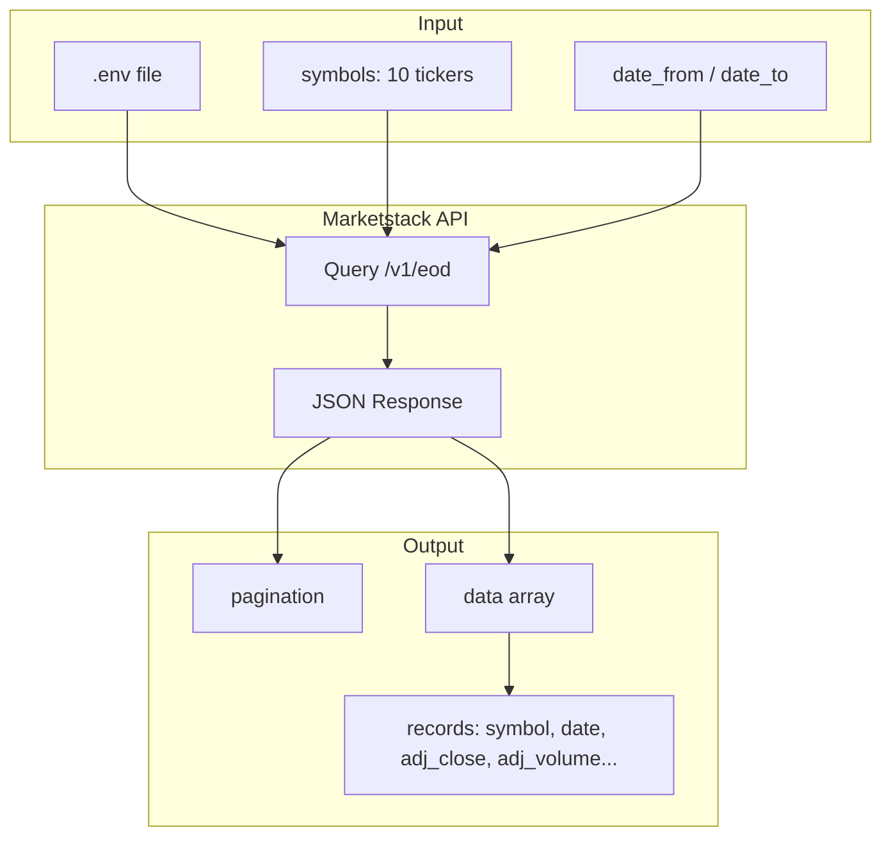

# Marketstack API Query Script

> Documentation for [`my_good_query.py`](my_good_query.py) — fetches end-of-day (EOD) stock price data from the Marketstack API.

---

## Overview

This script queries the **Marketstack** API to retrieve historical end-of-day stock prices for 10 technology companies. It returns one record per stock per trading day within a specified date range, useful for building financial reporters or time-series analysis applications.

**Key features:**
- Loads API key securely from `.env`
- Fetches ~100 records (10 companies × ~10 trading days)
- Includes error handling for failed requests
- Returns JSON response with OHLCV (Open, High, Low, Close, Volume) data

---

## API Endpoint & Parameters

| Item | Value |
|------|-------|
| **Base URL** | `http://api.marketstack.com/v1/eod` |
| **Method** | GET |
| **Authentication** | API key via query parameter |

### Query Parameters

| Parameter | Required | Description |
|-----------|----------|-------------|
| `access_key` | Yes | API key loaded from `.env` |
| `symbols` | Yes | Comma-separated stock tickers: `AAPL,MSFT,GOOGL,AMZN,META,NVDA,TCEHY,BABA,IBM,ORCL` |
| `date_from` | Yes | Start date (YYYY-MM-DD), e.g. `2025-10-01` |
| `date_to` | Yes | End date (YYYY-MM-DD), e.g. `2025-12-31` |

---

## Data Structure

The API returns a JSON object with two top-level keys:

```
response
├── pagination
│   ├── limit       (int)  — max records per page
│   ├── offset      (int)  — pagination offset
│   ├── count       (int)  — records in this response
│   └── total       (int)  — total records matching query
└── data            (array of objects)
    └── [record]
        ├── symbol       (str)  — stock ticker (e.g., "AAPL")
        ├── date         (str)  — ISO timestamp (e.g., "2025-10-01T00:00:00+0000")
        ├── open         (float)
        ├── high         (float)
        ├── low          (float)
        ├── close        (float)
        ├── volume       (float)
        ├── adj_open     (float) — adjusted for splits/dividends
        ├── adj_high     (float)
        ├── adj_low      (float)
        ├── adj_close    (float) — key field for analysis
        ├── adj_volume   (float) — key field for analysis
        ├── split_factor (float)
        ├── dividend     (float)
        └── exchange     (str)  — exchange code (e.g., "XNAS")
```

**Key fields for analysis:** `symbol`, `date`, `adj_close`, `adj_volume`

---

## Request Flow (Mermaid)



**Data flow diagram:**



---

## Usage Instructions

### Prerequisites

1. **Python packages:** `requests`, `python-dotenv`
   ```bash
   pip install requests python-dotenv
   ```

2. **API key:** Sign up at [Marketstack](https://marketstack.com/) and obtain an access key.

3. **Environment file:** Create a `.env` file in the project root (or same directory as the script):
   ```
   access_key=your_marketstack_api_key_here
   ```

### Running the Script

From the `01_query_api` directory (or project root if `.env` is there):

```bash
python my_good_query.py
```

Or with explicit path:

```bash
python 01_query_api/my_good_query.py
```

**Note:** Ensure the script can find `.env`. The script uses `load_dotenv(".env")`, so either run from the directory containing `.env` or adjust the path in the script.

### Expected Output

- **Success:** Prints HTTP status code (200) and the full JSON response.
- **Failure:** Prints error message and status code; raises `RequestException` on request errors.

---

## Related Files

- [LAB: Develop a Meaningful API Query](LAB_your_good_api_query.md) — Lab assignment this script fulfills
- [READ: Finding APIs](READ_find_apis.md) — How to find and evaluate APIs
- [Marketstack API Documentation](https://marketstack.com/documentation) — Official API docs

---
