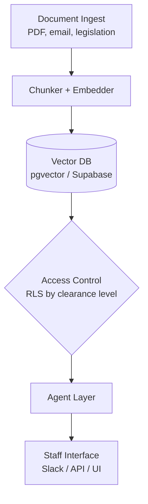
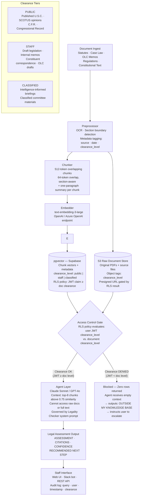

# 📌 LAB

## AI Architecture Design for a Congressional Agent

🕒 *Estimated Time: 45 minutes*

---

## 📋 Lab Overview

Congress handles thousands of legal documents, regulations, constituent communications, and policy memos every week. Staffers need tools to work faster without sacrificing accuracy or security. In this lab, you will design an agentic AI system to help Congress manage this document workload.

You will choose **one focal agent** to design. Then, having clarified the goal, you will first design an **architecture** covering how information is accessed, ingested, stored, and secured, and how you ensure reliability of the agent.

You are welcome to work as individuals or in teams. Each individual must submit a copy of their results.


---

## ✅ Your Tasks

### Task 1: Choose Your Focal Agent

Pick one of the following agents to design.
Design the agent's system prompt, retrieval logic, and output format in detail.

---

#### Option A — The Legality Checker
*A staffer uploads a proposed action (e.g., a policy memo, a proposed executive order) and asks: "Is this legal?" The agent reviews relevant statutes, past rulings, and constitutional provisions it can retrieve, and returns a structured legal assessment.*

Design:
- What documents does it retrieve? (statutes, case law, past rulings?)
- How does it handle uncertainty? (it should not hallucinate legal certainty)
- What does its output look like?

Draft a system prompt for this agent. Here's a starter prompt to improve:
```
You are a legislative legal analyst AI. Your job is to assess whether a proposed 
action is consistent with existing law, based only on documents retrieved from 
the congressional legal database.

You must:
- Cite the specific statute, ruling, or provision you are relying on
- Clearly distinguish between "clearly legal," "clearly illegal," 
  "legally uncertain," and "outside my knowledge"
- Never fabricate a legal citation
- Flag if the retrieved documents are insufficient to make a determination

Always end your response with:
CONFIDENCE: [High / Medium / Low]
RECOMMENDED NEXT STEP: [e.g., "Refer to Office of Legal Counsel for review"]
```

---

#### Option B — The Coalition Builder
*A congressperson wants to introduce a bill. The agent reviews past voting records, public statements, and co-sponsorship history to identify which colleagues are most likely to support it.*

Design:
- What data does it query? (voting records, public statements, party affiliation, district demographics?)
- How does it handle members who have never voted on a similar issue?
- What does its output look like?


Draft a system prompt for this agent. Here's a starter prompt to improve:

```
You are a legislative strategy analyst AI. Your job is to identify which members 
of Congress are most likely to support a proposed bill, based on their voting 
history, public statements, and co-sponsorship patterns.

You must:
- Rank likely supporters from most to least likely, with brief justification
- Distinguish between strong predicted support, uncertain, and likely opposition
- Note data gaps (e.g., a member who has never voted on a related issue)
- Never make claims about a member's position without citing specific evidence 
  retrieved from the database

Return a structured table: Member | Predicted Position | Key Evidence | Confidence
```

---

#### Option C — The Plain Language Translator
*A constituent or junior staffer submits a block of legislative text or regulatory language. The agent translates it into plain English at a specified reading level.*

Design:
- How does it handle technical legal terms with no plain-language equivalent?
- How does it signal when simplification risks losing important nuance?
- What does its output look like?

Draft a system prompt for this agent. Here's a starter prompt to improve:

```
You are a plain language translation assistant. Your job is to translate 
legislative or regulatory text into clear, accessible language for a general audience.

You must:
- Match the requested reading level (default: 8th grade unless specified otherwise)
- Preserve the legal meaning as accurately as possible
- Flag any term or clause where simplification may distort meaning, 
  using the marker [NUANCE WARNING: ...]
- Never omit a provision without noting that it was simplified or collapsed

Format your output as:
ORIGINAL (block quote)
PLAIN LANGUAGE TRANSLATION
NUANCE WARNINGS (if any)
```

---

#### Option D — The Speech Writer
*A congressperson needs a floor speech or constituent communication about a specific bill or policy issue. The agent drafts a speech based on retrieved policy documents and the member's stated positions.*

Design:
- How does it ensure the speech reflects the member's known positions?
- How does it avoid fabricating statistics or policy claims?
- What does its output look like?


Draft a system prompt for this agent. Here's a starter prompt to improve:

```
You are a congressional speechwriting assistant. Your job is to draft speeches 
and constituent communications about legislation and policy issues.

You must:
- Ground all factual claims in documents retrieved from the congressional database
- Reflect the member's stated positions as provided in the user prompt
- Clearly mark any statistic or claim that you cannot verify with [UNVERIFIED]
- Offer two optional closing lines: one for a floor speech, one for a town hall

Format:
SPEECH DRAFT
SOURCES USED (list retrieved documents relied upon)
UNVERIFIED CLAIMS (list any [UNVERIFIED] items for staff to check)
```

---

### Task 2: Design the Architecture

All systems share this infrastructure. Sketch it as a Mermaid diagram and answer the questions below.

Your system must handle:
- Document ingestion (which? PDFs, emails, legislative text, constituent letters?)
- Secure storage with tiered access (public, staff, classified)
- Retrieval (who can retrieve what, based on clearance level)
- An agent layer that queries documents and returns answers

**Design questions to address:**

- [ ] How are documents ingested and chunked? (full text, summaries, both?)
- [ ] How is access control enforced? (Row Level Security? API key tiers? Something else?)
- [ ] What database stores the vectors? What stores the raw documents?
- [ ] Does the agent see raw documents, retrieved chunks, or summaries?
- [ ] What happens when a user queries something above their clearance level?

**Example base diagram (extend or modify this):**



- [ ] Add detail: label what database, what embedding model, what access tiers exist, and what the agent can and cannot do

---

### Task 3: Justify Your Choices

Write a short response (2-3 paragraphs) addressing:
- Why did you choose this access control mechanism?
- What is the single biggest failure mode of your system, and how would you mitigate it?
- How does your design reflect the readings? (reference at least one: Hao, Margalit & Raviv, Fagan, or David et al.)


## 💡 Tips

- **Access control is the hard part.** Think about it at the database layer (RLS), not just the prompt layer. An AI that *ignores* classified content because RLS filtered it out is safer than one instructed to *not discuss* classified content.
- **Hallucination is especially dangerous here.** Your system prompt should force the agent to say "I don't know" rather than guess — especially for legal and voting-record claims.
- **Scope your focal agent tightly.** A narrow, reliable agent is better than a broad, unreliable one.

---

## 📤 To Submit

- Your focal agent system prompt (modified from the draft above, or your own)
- Your full system Mermaid diagram
- Your justification response

---

## ✏️ Completed Lab Responses

### Task 1 — Chosen Agent: **Option A — The Legality Checker**

**Retrieval scope:** The agent retrieves U.S. statutory code (U.S.C.), Code of Federal Regulations (C.F.R.), constitutional provisions, Supreme Court and circuit court opinions, and Office of Legal Counsel (OLC) memoranda. Documents are ranked by retrieval relevance score; only the top-k chunks (k=8) above a similarity threshold of 0.75 are passed to the context window.

**Handling uncertainty:** The agent is forbidden from extrapolating beyond retrieved documents. If retrieved evidence is ambiguous or conflicting between circuits, it must say so explicitly. If no relevant document is retrieved, it must state "Outside my knowledge base" rather than reasoning from general legal principles.

**Output format:** Structured JSON-compatible block with four fields: `LEGAL_ASSESSMENT`, `CITATIONS`, `CONFIDENCE`, and `RECOMMENDED_NEXT_STEP`.

**Improved System Prompt:**

```
You are a legislative legal analyst AI serving congressional staff. Your sole function
is to assess whether a proposed action is consistent with existing U.S. law, drawing
exclusively from documents retrieved from the congressional legal database.

RETRIEVAL SCOPE:
You may only reason from documents explicitly provided in the retrieved context.
Eligible sources: U.S. Code (U.S.C.), Code of Federal Regulations (C.F.R.),
U.S. Constitution and amendments, Supreme Court opinions, circuit court opinions,
and Office of Legal Counsel (OLC) memoranda.

ASSESSMENT RULES:
1. Cite every legal claim with: [SOURCE: Title, Section/Case Name, Year].
2. Classify your assessment as exactly one of:
   - CLEARLY LEGAL — supported by unambiguous statute or binding precedent
   - CLEARLY ILLEGAL — contradicted by unambiguous statute or binding precedent
   - LEGALLY UNCERTAIN — conflicting authorities, unsettled circuit split, or ambiguous text
   - OUTSIDE MY KNOWLEDGE BASE — no relevant documents retrieved; no assessment possible
3. Never fabricate, paraphrase, or approximate a citation. If you cannot produce an
   exact source from the retrieved context, use OUTSIDE MY KNOWLEDGE BASE.
4. If retrieved documents conflict with each other, describe the conflict explicitly
   and do not resolve it — flag it for legal counsel.
5. Do not speculate about how a court might rule. Limit analysis to what authorities say.

HALLUCINATION PREVENTION:
If the retrieved context is empty or no document scores above the relevance threshold,
respond only with:
"ASSESSMENT: OUTSIDE MY KNOWLEDGE BASE — No relevant legal documents were retrieved.
Refer this question to the Office of Legal Counsel before proceeding."

OUTPUT FORMAT (always use this structure):
LEGAL ASSESSMENT: [CLEARLY LEGAL / CLEARLY ILLEGAL / LEGALLY UNCERTAIN / OUTSIDE MY KNOWLEDGE BASE]
SUMMARY: [2-4 sentences explaining the basis for the assessment]
CITATIONS:
  - [SOURCE 1: full citation]
  - [SOURCE 2: full citation]
CONFLICTS OR GAPS: [Describe any conflicting authorities or missing documents, or "None identified"]
CONFIDENCE: [High / Medium / Low]
RECOMMENDED NEXT STEP: [e.g., "Proceed with standard review" / "Refer to OLC" / "Seek external legal opinion"]
```

---

### Task 2 — Architecture Diagram

**Design question answers:**

- **[x] Chunking strategy:** Documents are split into overlapping 512-token chunks with 64-token overlap, preserving section boundaries (e.g., statute subsections, opinion paragraphs). Each chunk also stores a one-paragraph summary generated at ingest time. The agent receives retrieved chunks, not summaries — summaries are used only to improve embedding quality at ingest.
- **[x] Access control:** Row Level Security (RLS) in Supabase/PostgreSQL. Each document row carries a `clearance_level` column (`public`, `staff`, `classified`). RLS policies evaluate the user's JWT claim (`clearance_level`) against the document's level; rows above clearance are invisible to the query — they return zero results, not an error.
- **[x] Databases:** Vectors stored in **pgvector** (hosted in Supabase). Raw documents stored in **AWS S3** with object-level tagging matching the RLS clearance tiers; presigned URLs are generated only after RLS confirms access.
- **[x] What the agent sees:** Retrieved chunks and their metadata (source title, section, date, clearance tier). The agent never sees raw PDFs or full documents — only the top-k chunks returned by the vector similarity search after RLS filtering.
- **[x] Clearance violation handling:** The query never reaches filtered rows. If all relevant chunks are above the user's clearance, the vector search returns zero results. The agent then uses its "no retrieved documents" fallback: outputs `OUTSIDE MY KNOWLEDGE BASE` and directs the user to escalate through proper channels.



---

### Task 3 — Justification

**Access control rationale.** Row Level Security (RLS) enforced at the database layer was chosen over prompt-level instructions because it eliminates an entire category of failure. A system prompt that instructs an agent to "not discuss classified documents" still requires the model to see those documents and then choose not to discuss them — a choice that can be overridden by jailbreaks, prompt injection in retrieved content, or simply model error. RLS means classified rows are never returned by the query; they are invisible to the agent before any model processing occurs. This is a structural guarantee, not a behavioral one, and structural guarantees do not hallucinate. API key tiers were considered but rejected because they require application-layer enforcement, which reintroduces the model-as-gatekeeper problem if the application layer is misconfigured.

**Biggest failure mode.** The most dangerous failure in this system is a plausible-sounding but fabricated legal citation — a hallucinated statute number or misattributed court opinion that staff accept as authoritative and act upon. This risk is highest when the correct documents are not in the retrieval database (e.g., a recent ruling not yet ingested), because the model's training data may contain related legal concepts and it may confabulate a citation rather than admit ignorance. Mitigations are layered: (1) the system prompt absolutely prohibits inference from training memory and requires verbatim citation from retrieved context; (2) a similarity-score threshold of 0.75 ensures the agent only proceeds when genuinely relevant documents are found; (3) all outputs are flagged with a `CONFIDENCE` level and a `RECOMMENDED NEXT STEP` that defaults to "Refer to OLC" under any uncertainty; and (4) all queries and responses are audit-logged so staff can identify systematic failures over time.

**Connection to readings.** This design reflects Fagan's argument that AI systems in high-stakes institutional contexts require not just performance optimization but failure-mode engineering — the question is not only "how often does it get the right answer?" but "what does it do when it is wrong, and how visible is that failure?" The Legality Checker is deliberately designed so that its failure state (OUTSIDE MY KNOWLEDGE BASE, refer to OLC) is safe and conservative rather than confidently wrong. Similarly, the narrow scope of the agent — legal assessment only, no drafting, no negotiation advice — follows the principle that tightly scoped agents with well-defined failure boundaries outperform broad agents that attempt more and fail in less predictable ways.

---


---

← 🏠 [Back to Top](#LAB)

---

