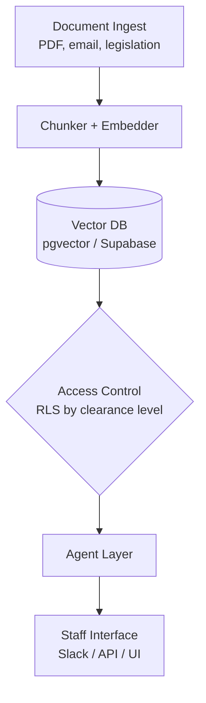
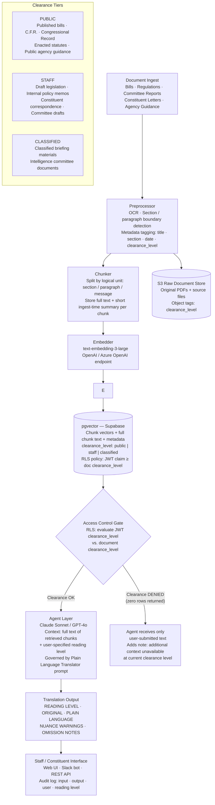

# 📌 LAB

## AI Architecture Design for a Congressional Agent

🕒 *Estimated Time: 45 minutes*

---

## 📋 Lab Overview

Congress handles thousands of legal documents, regulations, constituent communications, and policy memos every week. Staffers need tools to work faster without sacrificing accuracy or security. In this lab, you will design an agentic AI system to help Congress manage this document workload.

You will choose **one focal agent** to design. Then, having clarified the goal, you will first design an **architecture** covering how information is accessed, ingested, stored, and secured, and how you ensure reliability of the agent.

You are welcome to work as individuals or in teams. Each individual must submit a copy of their results.


---

## ✅ Your Tasks

### Task 1: Choose Your Focal Agent

Pick one of the following agents to design.
Design the agent's system prompt, retrieval logic, and output format in detail.

---

#### Option A — The Legality Checker
*A staffer uploads a proposed action (e.g., a policy memo, a proposed executive order) and asks: "Is this legal?" The agent reviews relevant statutes, past rulings, and constitutional provisions it can retrieve, and returns a structured legal assessment.*

Design:
- What documents does it retrieve? (statutes, case law, past rulings?)
- How does it handle uncertainty? (it should not hallucinate legal certainty)
- What does its output look like?

Draft a system prompt for this agent. Here's a starter prompt to improve:
```
You are a legislative legal analyst AI. Your job is to assess whether a proposed 
action is consistent with existing law, based only on documents retrieved from 
the congressional legal database.

You must:
- Cite the specific statute, ruling, or provision you are relying on
- Clearly distinguish between "clearly legal," "clearly illegal," 
  "legally uncertain," and "outside my knowledge"
- Never fabricate a legal citation
- Flag if the retrieved documents are insufficient to make a determination

Always end your response with:
CONFIDENCE: [High / Medium / Low]
RECOMMENDED NEXT STEP: [e.g., "Refer to Office of Legal Counsel for review"]
```

---

#### Option B — The Coalition Builder
*A congressperson wants to introduce a bill. The agent reviews past voting records, public statements, and co-sponsorship history to identify which colleagues are most likely to support it.*

Design:
- What data does it query? (voting records, public statements, party affiliation, district demographics?)
- How does it handle members who have never voted on a similar issue?
- What does its output look like?


Draft a system prompt for this agent. Here's a starter prompt to improve:

```
You are a legislative strategy analyst AI. Your job is to identify which members 
of Congress are most likely to support a proposed bill, based on their voting 
history, public statements, and co-sponsorship patterns.

You must:
- Rank likely supporters from most to least likely, with brief justification
- Distinguish between strong predicted support, uncertain, and likely opposition
- Note data gaps (e.g., a member who has never voted on a related issue)
- Never make claims about a member's position without citing specific evidence 
  retrieved from the database

Return a structured table: Member | Predicted Position | Key Evidence | Confidence
```

---

#### Option C — The Plain Language Translator
*A constituent or junior staffer submits a block of legislative text or regulatory language. The agent translates it into plain English at a specified reading level.*

Design:
- How does it handle technical legal terms with no plain-language equivalent?
- How does it signal when simplification risks losing important nuance?
- What does its output look like?

Draft a system prompt for this agent. Here's a starter prompt to improve:

```
You are a plain language translation assistant. Your job is to translate 
legislative or regulatory text into clear, accessible language for a general audience.

You must:
- Match the requested reading level (default: 8th grade unless specified otherwise)
- Preserve the legal meaning as accurately as possible
- Flag any term or clause where simplification may distort meaning, 
  using the marker [NUANCE WARNING: ...]
- Never omit a provision without noting that it was simplified or collapsed

Format your output as:
ORIGINAL (block quote)
PLAIN LANGUAGE TRANSLATION
NUANCE WARNINGS (if any)
```

---

#### Option D — The Speech Writer
*A congressperson needs a floor speech or constituent communication about a specific bill or policy issue. The agent drafts a speech based on retrieved policy documents and the member's stated positions.*

Design:
- How does it ensure the speech reflects the member's known positions?
- How does it avoid fabricating statistics or policy claims?
- What does its output look like?


Draft a system prompt for this agent. Here's a starter prompt to improve:

```
You are a congressional speechwriting assistant. Your job is to draft speeches 
and constituent communications about legislation and policy issues.

You must:
- Ground all factual claims in documents retrieved from the congressional database
- Reflect the member's stated positions as provided in the user prompt
- Clearly mark any statistic or claim that you cannot verify with [UNVERIFIED]
- Offer two optional closing lines: one for a floor speech, one for a town hall

Format:
SPEECH DRAFT
SOURCES USED (list retrieved documents relied upon)
UNVERIFIED CLAIMS (list any [UNVERIFIED] items for staff to check)
```

---

### Task 2: Design the Architecture

All systems share this infrastructure. Sketch it as a Mermaid diagram and answer the questions below.

Your system must handle:
- Document ingestion (which? PDFs, emails, legislative text, constituent letters?)
- Secure storage with tiered access (public, staff, classified)
- Retrieval (who can retrieve what, based on clearance level)
- An agent layer that queries documents and returns answers

**Design questions to address:**

- [ ] How are documents ingested and chunked? (full text, summaries, both?)
- [ ] How is access control enforced? (Row Level Security? API key tiers? Something else?)
- [ ] What database stores the vectors? What stores the raw documents?
- [ ] Does the agent see raw documents, retrieved chunks, or summaries?
- [ ] What happens when a user queries something above their clearance level?

**Example base diagram (extend or modify this):**



- [ ] Add detail: label what database, what embedding model, what access tiers exist, and what the agent can and cannot do

---

### Task 3: Justify Your Choices

Write a short response (2-3 paragraphs) addressing:
- Why did you choose this access control mechanism?
- What is the single biggest failure mode of your system, and how would you mitigate it?
- How does your design reflect the readings? (reference at least one: Hao, Margalit & Raviv, Fagan, or David et al.)


## 💡 Tips

- **Access control is the hard part.** Think about it at the database layer (RLS), not just the prompt layer. An AI that *ignores* classified content because RLS filtered it out is safer than one instructed to *not discuss* classified content.
- **Hallucination is especially dangerous here.** Your system prompt should force the agent to say "I don't know" rather than guess — especially for legal and voting-record claims.
- **Scope your focal agent tightly.** A narrow, reliable agent is better than a broad, unreliable one.

---

## 📤 To Submit

- Your focal agent system prompt (modified from the draft above, or your own)
- Your full system Mermaid diagram
- Your justification response

---

## ✏️ Completed Lab Responses

### Task 1 — Chosen Agent: **Option C — The Plain Language Translator**

**Handling technical terms:** The agent must never silently drop or substitute a term with no plain-language equivalent. Instead it preserves the original term in parentheses alongside the simplified version (e.g., "the right to challenge your detention in court (habeas corpus)") and appends a `[NUANCE WARNING]` when the simplification risks altering the legal or policy meaning.

**Signaling meaning loss:** The agent uses two explicit markers: `[NUANCE WARNING: ...]` for clauses where simplification may distort meaning, and `[OMISSION NOTE: ...]` when a provision is collapsed or summarized rather than translated in full. It never silently omit content.

**Output format:** Three clearly labeled sections — `ORIGINAL` (block quote), `PLAIN LANGUAGE TRANSLATION`, and `NUANCE WARNINGS / OMISSION NOTES` — with a reading-level tag at the top.

**Improved System Prompt:**

```
You are a plain language translation assistant for congressional staff and constituents.
Your job is to translate legislative or regulatory text into clear, accessible language
at a specified reading level.

INPUT:
- The text to translate (provided by the user)
- Target reading level (default: 8th grade unless the user specifies otherwise)

TRANSLATION RULES:
1. Match the requested reading level as closely as possible. Use shorter sentences,
   common words, and active voice. Do not use legal jargon without explanation.
2. When a legal or technical term has no plain-language equivalent, keep the original
   term in parentheses after your simplified version.
   Example: "the right to challenge your detention in court (habeas corpus)"
3. Preserve the legal meaning as accurately as possible. Do not interpret, opine, or
   predict how a provision might be applied — only translate what the text says.
4. For every clause where simplification may distort the legal or policy meaning,
   insert a [NUANCE WARNING: brief explanation of what may be lost].
5. If a provision is too complex to translate at the target reading level without
   losing essential meaning, translate it as best you can and add:
   [OMISSION NOTE: this section was simplified — the full legal text governs].
6. Never silently drop a sentence, clause, or definition. Account for every provision,
   even if only to note it was collapsed.
7. Do not add information, context, or examples that are not in the source text.

OUTPUT FORMAT (always use this structure):
READING LEVEL: [e.g., 8th grade]
---
ORIGINAL:
> [paste source text as block quote]

PLAIN LANGUAGE TRANSLATION:
[your translation here, with inline [NUANCE WARNING] and [OMISSION NOTE] markers]

NUANCE WARNINGS AND OMISSION NOTES:
- [list each warning/note with the relevant clause for easy staff review]
  (write "None" if the translation is complete and faithful)
```

---

### Task 2 — Architecture Diagram

**Design question answers:**

- **[x] Chunking strategy:** Documents are split by logical unit — bills by section, regulations by paragraph, constituent letters by message. Each chunk stores the full text of that unit plus a short plain-English summary generated at ingest (used to improve embedding quality, not shown to the agent). The agent receives the full retrieved chunks so it can translate the complete original text without gaps.
- **[x] Access control:** Row Level Security (RLS) in Supabase/PostgreSQL. Each document row carries a `clearance_level` column (`public`, `staff`, `classified`). RLS policies compare the user's JWT claim against the document's clearance level; rows above the user's clearance are never returned. For the Plain Language Translator specifically, most source documents will be public (published bills, regulations), but internal drafts and constituent letters require staff or higher clearance.
- **[x] Databases:** Vectors stored in **pgvector** (hosted in Supabase). Raw documents stored in **AWS S3** with object-level clearance tags; the agent receives the text content of retrieved chunks, not presigned URLs to raw files.
- **[x] What the agent sees:** Full text of retrieved chunks (the original legislative or regulatory language), plus metadata (document title, section number, clearance tier, date). The agent needs the verbatim source text to translate accurately — it does not receive summaries.
- **[x] Clearance violation handling:** RLS filters inaccessible rows before the vector search result reaches the agent. If a user submits text that originated from a classified document and no matching chunks are returned at their clearance level, the agent translates only the text explicitly provided in the user's input and notes that it cannot retrieve additional context.



---

### Task 3 — Justification

**Access control rationale.** RLS at the database layer was chosen over prompt-level access rules for the same structural reason it is the right choice for any of these agents: an instruction to "not translate classified documents" still exposes those documents to the model before it decides not to act on them. RLS means classified rows are invisible to the query entirely. For the Plain Language Translator specifically this matters even more than it might seem, because translation is a low-stakes-sounding task — a user might not realize they are requesting access to restricted content. The clearance gate needs to operate before the agent ever sees the source text, not after. For most use cases the translator will work entirely with public documents (published bills, the C.F.R., enacted statutes), but constituent letters and internal draft legislation require staff-level access, so the tiered system must be in place from the start.

**Biggest failure mode.** The single greatest risk is a translation that quietly alters the legal meaning of a provision without triggering a `[NUANCE WARNING]` — what might be called a silent distortion. This is especially dangerous for conditional clauses ("unless," "except where," "notwithstanding"), defined terms whose plain-English equivalent is subtly broader or narrower, and cross-references to other sections that the translation collapses. A staffer or constituent who reads the plain-language version and acts on it may be operating under a misunderstanding of what the law actually requires. Mitigations include: (1) the system prompt requires the agent to account for every provision and never silently drop clauses; (2) legal and technical terms must always appear alongside their simplified version rather than being replaced; (3) every translation output includes a dedicated `NUANCE WARNINGS AND OMISSION NOTES` section that staff must review before sharing with constituents; and (4) the interface labels outputs clearly as AI-generated translations, not legal interpretations.

**Connection to readings.** This design reflects the concern raised by Hao and others that AI systems deployed in institutional contexts tend to create a false sense of confidence in their outputs. Plain language translation feels low-risk — it is "just rewording" — but the gap between a translation that is readable and one that is accurate is precisely where harm enters. The output format is designed to resist that false confidence: the original text is always present alongside the translation, every simplification that risks distortion is flagged, and the system makes its limitations visible rather than hiding them in a smooth-sounding summary. Consistent with the principle that narrow, reliable agents outperform broad ones, this agent does only translation — it does not assess legality, make policy recommendations, or synthesize across documents — which keeps its failure modes predictable and auditable.

---


---

← 🏠 [Back to Top](#LAB)

---

